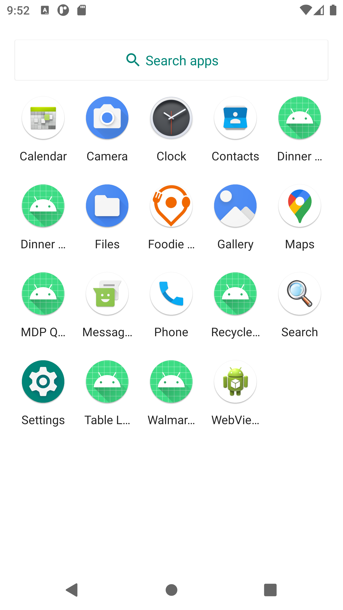
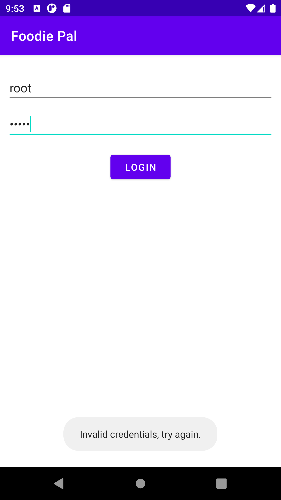
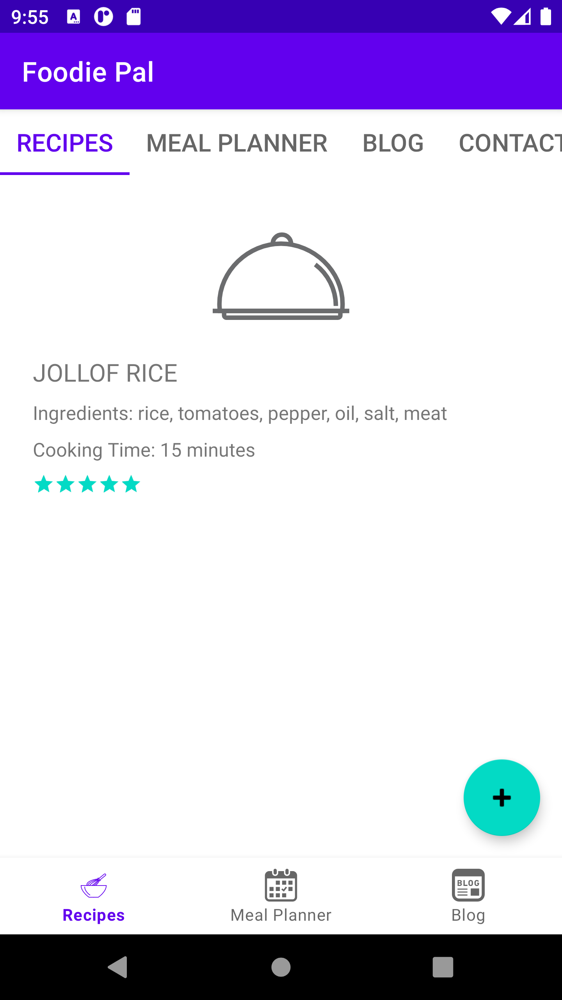
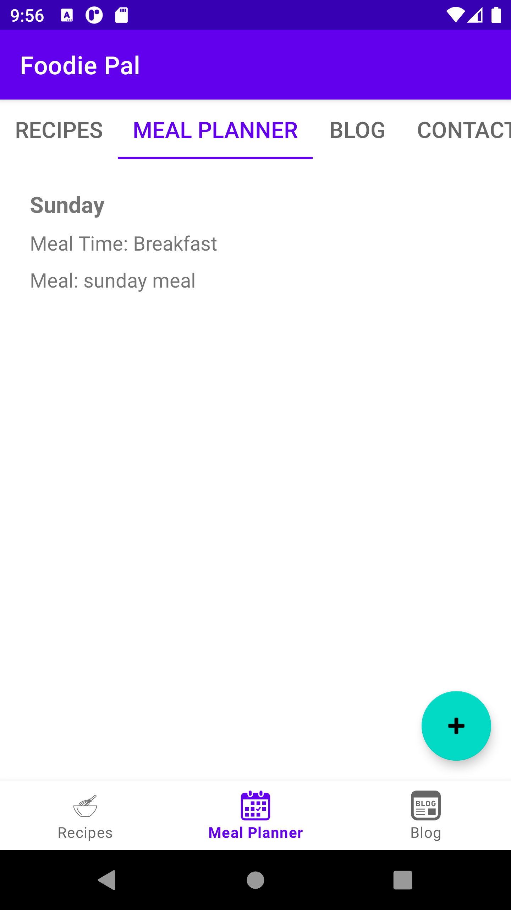
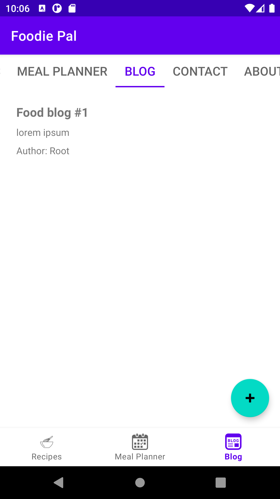
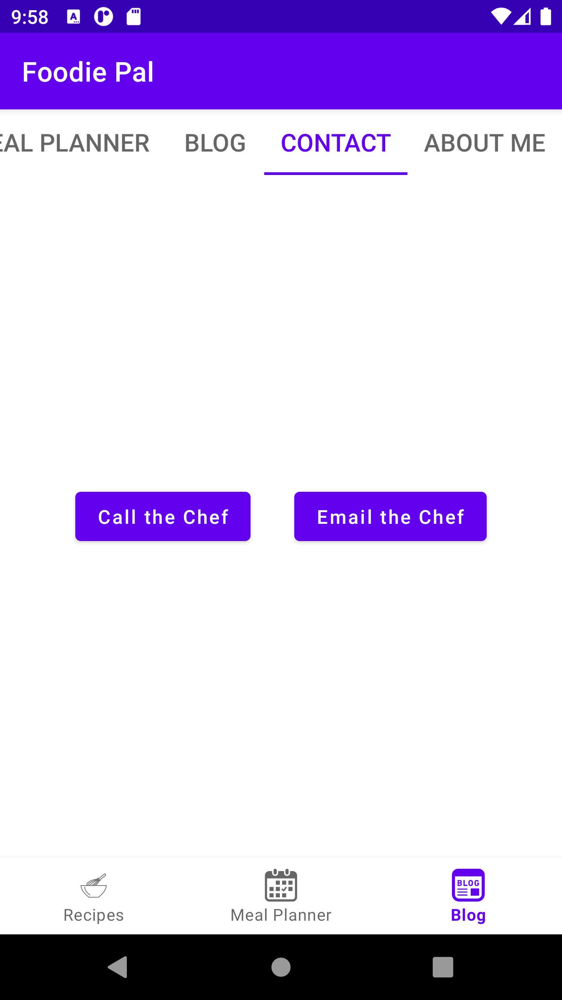
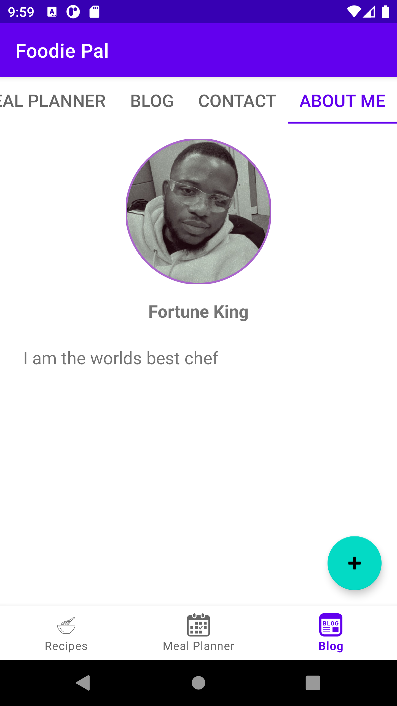

# FoodiePal - Culinary Companion :spaghetti:

FoodiePal is an interactive Android app tailored for food enthusiasts, aiming to provide a comprehensive culinary experience. With a blend of user-friendly design and a range of features, FoodiePal allows users to explore, plan meals, read blogs, and delve into the app creator's culinary journey.

## Features

- Implemented a secure authentication system for accessing the app.
- User authentication includes proper validation and securely stores login credentials using SharedPreferences for a seamless login experience.
- Developed a Tab Layout with six tabs, including Fragments focusing on Recipes, Meal Planner, Blog, Contact, and About Me sections.
- Dynamic display of recipes using RecyclerView.
- Each recipe includes images, cooking time, and user ratings for enhanced user experience.
- Implemented a Floating Action Button (FAB) enabling users to add new recipes dynamically.
- Integrated a meal planning feature allowing users to schedule meals for specific days.
- Visual representation through a calendar in RecyclerView for easy weekly meal planning.
- Developed a dynamic blog section with regularly updated content.
- Utilized a Floating Action Button (FAB) to enable users to add new blog posts.
- Provided multiple ways for users to engage, including direct phone dialing and emailing options for quick communication.
- Detailed information about the app creator's culinary journey, favorite recipes, and food philosophy.
- Integrated a Floating Action Button to add new details dynamically.
- Implemented a Bottom Navigation bar for seamless navigation between the app's main sections.

## App Screens

### App Icon

### Login screen / invalid login

### Recipe screen

### Meal Planner

### Blog

### Contact Me

### About Me

## Installation
- Clone the repository.
- Open the project in Android Studio.
- Build and run the app on an Android device or emulator.

## Credits
This project was created by Fortune King.
